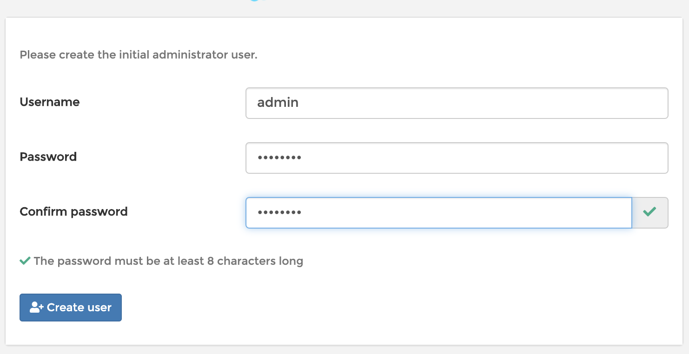
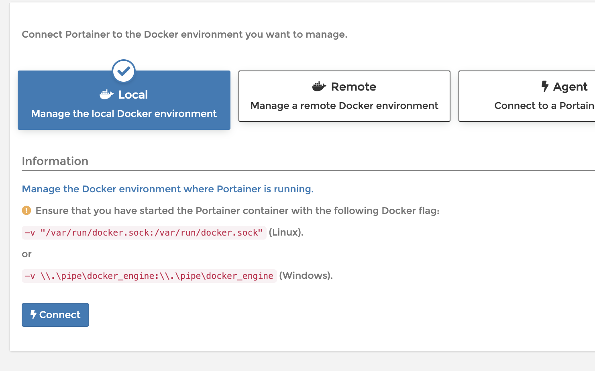
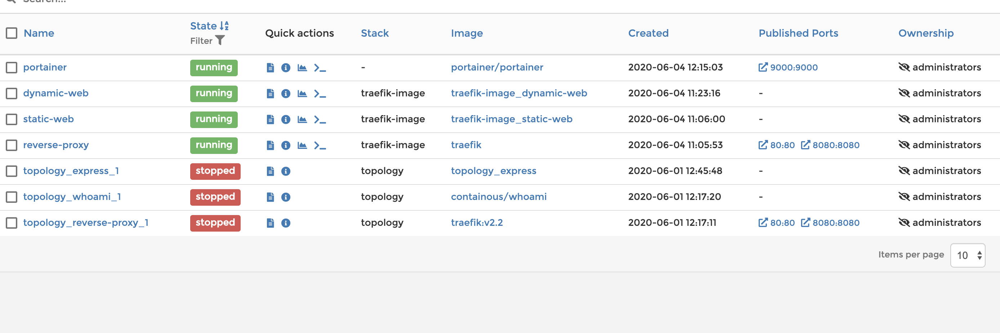

# HTTP Infrastructure Lab Doc for Grandmas

## Step 7: Management UI with Portainer

#### Goals

- view and modify our docker container from a graphic interface

### General idea

In this step we will not create or edit any file. The only thing we'll need to do will be to run a docker container based on a online portainer image. So the only thing we'll look at in this part of the report will be the steps to run the project.

### Simple steps to run this part of the project with docker desktop 

1. build and run the reverse-proxy :

   `docker-compose up -d --build reverse-proxy`

2. run the express server :

   `docker-compose up -d dynamic-web` 

   you can run as many as you want, this is the goal of load-balancing

3. run the web page:

   `docker-compose -d static-web`

4. run the portainer container: 

   `docker run -it -d --name portainer -v /var/run/docker.sock:/var/run/docker.sock -p 9000:9000 portainer/portainer`

5. On localhost:9000 we can see the portainer UI we will first need to create a user : 

   

   Then select local:

   

   and now we can access our containers: 

   

6. We can now go to `http://demo.res.ch/` to see our web page and to `http://demo.res.ch/api/students/` to see our json poems.

   

   

   

   