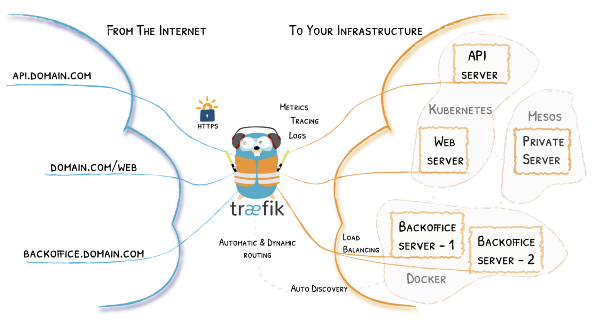
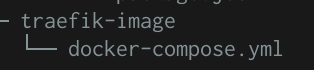

# HTTP Infrastructure Lab Doc for Grandmas

## Step 6: Load Balancing with Traefik

#### Goals

- modify our reverse proxy so that it also does the load balancing

### What is load-balancing ? 

In computing, **load balancing** refers to the process of distributing a set of [tasks](https://en.wikipedia.org/wiki/Task_(computing)) over a set of resources (computing units), with the aim of making their overall processing more efficient. Load balancing techniques can optimise the response time for each task, avoiding unevenly overloading compute nodes while other compute nodes are left idle.

Definition from : https://en.wikipedia.org/wiki/Load_balancing_(computing)

### Look at the traefik get started tutorial, to understand how everything works



​																*image 1: traefik graphic* 

We will only focus on the load balancing part. To understand how it work we will firstly take a look at the begginer's tutorial. 

This the docker-compose to get started :

``` 
version: '3'

services:
  reverse-proxy:
    # The official v2 Traefik docker image
    image: traefik:v2.2
    # Enables the web UI and tells Traefik to listen to docker
    command: --api.insecure=true --providers.docker
    ports:
      # The HTTP port
      - "80:80"
      # The Web UI (enabled by --api.insecure=true)
      - "8080:8080"
    volumes:
      # So that Traefik can listen to the Docker events
      - /var/run/docker.sock:/var/run/docker.sock
```

To start our reverse-proxy we use : `docker-compose up -d reverse-proxy` 

Now we only need to add our dynamic express server and our static web page in the docker compose. 

Our directory looks like this: 



### Add the other 2 images in the docker-compose

This a file existing in the official docker image, so we'll want to copy and past its original content and add a line to put the result of our php-config file into the 001-reverse-proxy.conf file we were talking about in the previous step. This is the line we need to add : 

``` 
version: "3.2"
services:
  dynamic-web:
    build: ../express-image/
    container_name: dynamic-web
    labels:
    # Enable reverse proxy exposing for this container
    - "traefik.enable=true"
    # Set routing rules
    - "traefik.http.routers.dynamic-web.rule=Host(`demo.res.ch`) && PathPrefix(`/api/students/`)"
    # Set reverse proxy entrypoint
    - "traefik.http.routers.dynamic-web.entrypoints=web"
    # Cut path prefix with middleware
    - "traefik.http.routers.dynamic-web.middlewares=dynamic-web-middleware"
    - "traefik.http.middlewares.dynamic-web-middleware.stripprefix.prefixes=/api/students/"
    # Specify backend port
    - "traefik.http.services.dynamic-web.loadbalancer.server.port=3000"
  static-web:
    build: ../apache-php-image/
    container_name: static-web
    labels:
    # Enable reverse proxy exposing for this container
    - "traefik.enable=true"
    # Set routing rules
    - "traefik.http.routers.static-web.rule=Host(`demo.res.ch`)"
    # Set reverse proxy entrypoint
    - "traefik.http.routers.static-web.entrypoints=web"
    # Specify backend port
    - "traefik.http.services.static-web.loadbalancer.server.port=80"
  reverse-proxy:
    image: traefik
    container_name: reverse-proxy
    command:
    # Enable traefik web interface
    - "--api.insecure=true"
    # Set docker as a provider
    - "--providers.docker=true"
    # Disable container auto-exposing
    - "--providers.docker.exposedbydefault=false"
    # Specify frontend port
    - "--entrypoints.web.address=:80"
    ports:
    # 80 for reverse proxy, 8080 for traefik web interface
    - "80:80"
    - "8080:8080"
    volumes:
    # Traefik need to have read-only access to the docker socket 
    - "/var/run/docker.sock:/var/run/docker.sock:ro"
```

We are now all set to run the project. 

### Simple steps to run this part of the project with docker desktop 

1. build and run the reverse-proxy :

   `docker-compose up -d --build reverse-proxy`

2. run the express server :

   `docker-compose up -d dynamic-web` 

   you can run as many as you want, this is the goal of load-balancing

3. run the web page:

   `docker-compose -d static-web`

4. We can now go to `http://demo.res.ch/` to see our web page and to `http://demo.res.ch/api/students/` to see our json poems. 

   

   

   