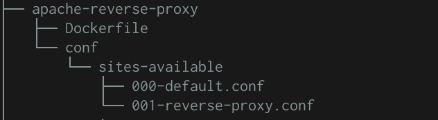
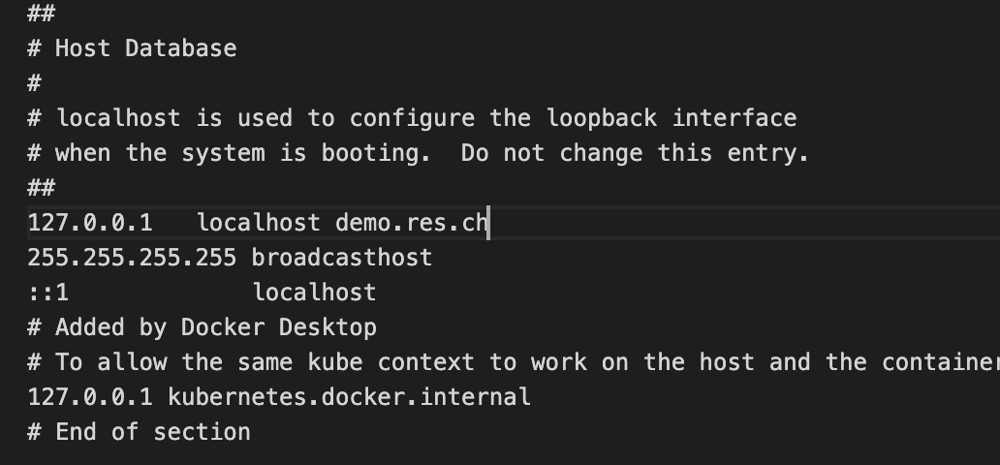

# HTTP Infrastructure Lab Doc for Grandmas

## Step 3: Reverse proxy with apache (static configuration)

#### Goals

- Create a Docker image based on the official apache-php image
- setup a static reverse proxy
- confirm that our reverse proxy correctly dispatches the requests

### Create the reverse proxy with apache 

As for the first step we took the apache-php image as a base and then wrote our Dockerfile as :

``` 
FROM php:7.2-apache

COPY conf/ /etc/apache2

RUN a2enmod proxy proxy_http
RUN a2ensite  000-* 001-* 
```

The first line tells docker to use the official docker image as a base. The second one copies our confirmation directory into `/etc/apache2`in the image. The last on tells docker to run the commands `a2enmod proxy proxy_http` and `a2ensite  000-* 001-*`when we run the image. 

Now our directory looks like this: 



​																		*image 5: directory tree*

The next step was to write the configuration files in the sites-available directory. Those files will be copied into the image's same directory (sites-available) when we build the image. We wrote them as follows: 

```
000-default.conf :

<VirtualHost *:80>
</VirtualHost>
```

It tells the reverse proxy to redirect every GET request to the default `GET / HTTP/1.0` . Which means to our `apache_static` container.

```
001-default.conf :

<VirtualHost *:80>
    Servername demo.res.ch

    ProxyPass "/api/students/" "http://172.17.0.2:3000/"
    ProxyPassReverse "/api/students/" "http://172.17.0.2:3000/"

    ProxyPass "/" "http://172.17.0.3:80/"
    ProxyPassReverse "/" "http://172.17.0.3:80/"

</VirtualHost>
```

This ones tells the reverse proxy to send the `GET /api/students/ HTTP/1.0` requests to our `express_dynamic` container and the  `GET / HTTP/1.0`  to our `apache_static` container.
This is not a good way of doing this because the IP adresses are hardcoded which means that we need to check if the IPs are correct each time we start a new container. 

We now have everything setup to run our project.

### Simple steps to run this part of the project with docker desktop 

1. Run an `express_dynamic` and an `apache_static` container, the steps do that are described in the other branches of the project. You'll want to do the following commands: 
   `docker run -d --name apache_static res/apache_php` 

   `docker run -d --name express_dynamic res/express_students`

2. Find the IP addresses of your two containers: 
   `docker inspect apache_static | grep -i ipaddress`

   `docker inspect express_dynamic | grep -i ipaddress`

3. If the IP adresses are different from the ones already in the `conf`file we described before, you will need to update it with the correct ones. 

4. Place yourself in the `apache-reverse-proxy`directory

5. build the docker image 

   ​	` docker build -t res/apache_rp .` 

   Where 

   - `docker build` tells docker to build an image
   - `-t` to do it in the background 
   - `res/apache_rp` is the name we chose for our image
   - `.` tells docker to look for the `conf` directory from our current directory

6. Run the docker image 

   `docker run -p 8080:80 res/apache_rp`

   Where 

   - `-p 8080:80` tells docker to do a port mapping, meaning that the container's port 80 is linked to our localhost port 8080
   - `res/apache_rp` is the name of the image we want to run

7. You can now use telnet do send GET requests do our new container:

   

   ```
   telnet localhost 8080
   
   GET / HTTP/1.0
   Host: demo.res.ch
   
   ```

   The response will be the http static page.	

```
	telnet localhost 8080

	GET /api/students/ HTTP/1.0
	Host: demo.res.ch

```

​		The response will be the json payload. 

8. This is nice but we'd love to see our pages in a browser. To do so we'll need to edit the hosts file on our computer.

   - write `code /etc/hosts` to open the file in visual studio code. 

   - edit the file to add `demo.res.ch` to our localhost IP address (vscode will ask your password to switch in sudo mode) :

     

9. Open your browser and go to 

   `http://demo.res.ch:8080/api/students/`to see our json payload

   `http://demo.res.ch:8080/`to see our static html pages


