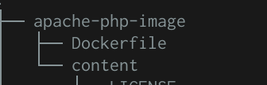

# HTTP Infrastructure Lab Doc for Grandmas

## Step 1: Static HTTP server with apache httpd

#### Goals 

- Create a Docker image based on the apache-php official image
- Build our image and run containers
- add HTML content
- make it prettier

###  Create a Docker image based on the apache-php official image, add html and run it 

We first want to find the apache-php image on Docker Hub. We chose this one and not the apache httpd one because we may want to use php later in this project.


​		*image 1: [official apache-php image documentation](https://hub.docker.com/_/php/)* 

The next step was to create our Dockerfile, we changed "src" to "content" to understand that we can modify our Dockerfile as much as we want. We then created our "content" directory. To fully undertsand what's going on we need to take a look at our directory:



​																	*image 2: directory tree*

We then added the following lines into our Dockerfile:

``` FROM php:7.2-apache
FROM php:7.2-apache
COPY content/ /var/www/html/
```

The first line is telling Docker to use the apache-php image as a base. The second one tells it to copy the content of the content directory into the `/var/www/html/` directory. So everything we put in `content` will be copied into our Docker image. That's why the next step is to put our HTML content into our content directory. For that we will just copy/paste a bootstrap template and modify the texts. 

We now have everything setup to run our project.

### Simple steps to run this part of the project with docker desktop 

1. Place yourself in the `apache-php-image` directory 

2. build the docker image 

   ​	` docker build -t res/apache_php .` 

   Where 

   - `docker build` tells docker to build an image
   - `-t` to do it in the background 
   - `res/apache_php` is the name we chose for our image
   - `.` tells docker to look for the `content` directory from our current directory

3. Run the docker image 

   `docker run -p 9090:80 res/apache_php`

   Where 

   - `-p 9090:80` tells docker to do a port mapping, meaning that the container's port 80 is linked to our localhost port 9090
   - `res/apache_php` is the name of the image we want to run

4. View the beautiful html page we just made

   - open your favorite browser 
   - You can see the page on `localhost:9090` 

